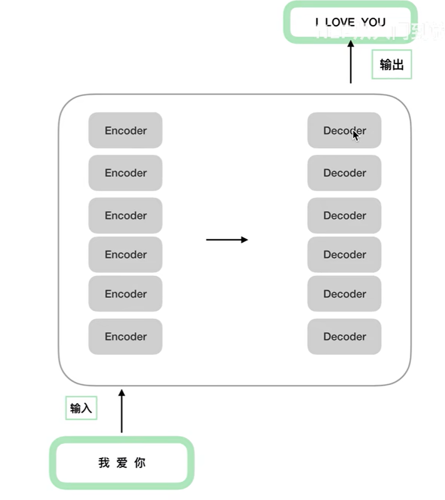

# Transformer 学习笔记

这一部分学习主要看了 B 站视频[Transformer从零详细解读(可能是你见过最通俗易懂的讲解)](https://www.bilibili.com/video/BV1Di4y1c7Zm/?spm_id_from=333.337.search-card.all.click&vd_source=1163cf8c6b67cb487398d52f85ef21a4)，在此前已经学习了吴恩达老师的机器学习和深度学习套件，学习笔记也可以放在这里（引个流hhh）：

1. [机器学习吴恩达老师课堂笔记（一）](https://zhuanlan.zhihu.com/p/662873124)、[机器学习吴恩达老师课堂笔记（二）](https://zhuanlan.zhihu.com/p/662954666)、[机器学习吴恩达老师课堂笔记（三）](https://zhuanlan.zhihu.com/p/663114735)、[机器学习吴恩达老师课堂笔记（四）](https://zhuanlan.zhihu.com/p/663225012)和[机器学习吴恩达老师课堂笔记（五）](https://zhuanlan.zhihu.com/p/663246516)
2. [深度学习吴恩达老师课堂笔记（一）](https://zhuanlan.zhihu.com/p/663532574)、[深度学习吴恩达老师课堂笔记（二）](https://zhuanlan.zhihu.com/p/663689302)、[深度学习吴恩达老师课堂笔记（三）](https://zhuanlan.zhihu.com/p/663867959)

接下来就进入正题开始讲 Transformer 了。这一部分和深度学习的最后一部分 NLP 可以连接上，比如想要完成机器翻译任务就可以借鉴这种 Encoder-Decoder 的格式来构建网络：

比较常见的实现方式就是深度网络模型，这里的 Encoder 和 Decoder **分别**都是结构完全相同但是*参数不相同*的网络层（注意这里是不同的层而不是在讲 RNN 循环神经网络）：

接下来可以看一下 Transformer 原论文中的网络结构：

首先图的左半部分就是 Encdoer 网络而右半部分就是 Decoder 网络，首先可以看到网络结构的左半部分和右半部分都有 $\times N$ 的符号，对应的就是上一张图中的多个结构完全相同的层；接下来的第二个发现就是 Encoder 网络和 Decoder 网络的结构其实是非常相似的：
