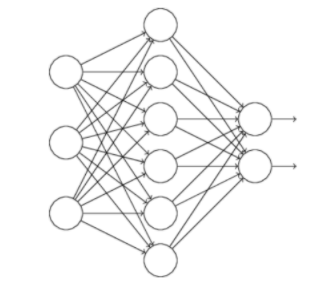
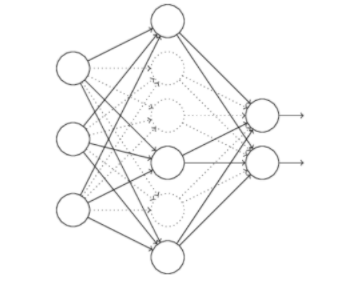
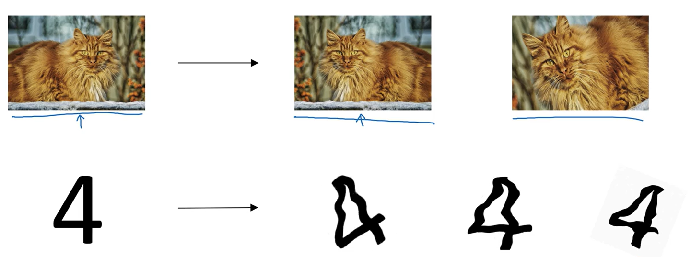

#! https://zhuanlan.zhihu.com/p/663689302
# 深度学习吴恩达老师课堂笔记（二）

这一部分主要就是续前面的[深度学习吴恩达老师课堂笔记（一）](https://zhuanlan.zhihu.com/p/663532574)继续学习，这里主要介绍一下深度学习网络相对于传统机器学习网络多出来的改善方案。

## 2. 改善深层神经网络：超参数调试、正则化以及优化

### 2.1 深度学习实践

在机器学习中典型的训练集-验证集-测试集的数据划分比例是`6:2:2`，但是在深度学习领域，在**样本数据量足够大**的情况下可以降低验证集和测试集的数据比例，比如可以调节成`0.98 : 0.01 : 0.01`甚至更低。

在训练网络的时候最好需要保证训练集和测试集同分布，这样有利于网络表现出更好的性能。在深度学习网络中，如果不需要获得网络性能的无偏估计，那么不设置测试集只设置训练集和验证集也是可以被接受的。

如果训练出来一个网络，首先可以观察一下网络在训练集上的正确率，如果在训练集上表现也很差说明网络陷入欠拟合（高偏差问题），那么就需要考虑更换网络结构比如使用更深层的网络或者增长训练时间等来解决高偏差问题（这是最低标准）；在实现训练集上的高正确率以后就可以检测网络在测试集上的性能，如果网络在测试集上表现不是很好说明网络陷入过拟合（高方差问题），此时可以考虑使用更多的数据集或者加入正则化来解决，不过有的时候也可以考虑更换网络结构。

常见的正则化分为 L2 正则化和 L1 正则化，前者使用的是参数的二范数而后者使用的是一范数：

<!--  -->
L1 正则化会导致参数的稀疏化（就是存在比较多的0），因此现在越来越多会使用 L2 正则化。而在描述矩阵的时候这个范数则被称为 Frobenius 范数，描述的是矩阵中每个元素的平方和。

加入正则化项以后的代价函数可以被写作：
$$
J(\boldsymbol{W}^{[1]},b^{[1]},\boldsymbol{W}^{[2]},b^{[2]},\cdots,\boldsymbol{W}^{[L]},b^{[L]})=\frac{1}{m}\sum_{i=1}^mL(\hat y^{(i)},y^{(i)})+\frac{\lambda}{2m}\sum_{l=1}^L||\boldsymbol{W}^{[l]}||_F^2\\
$$
在梯度下降的时候前半部分的梯度仍然保持不变，而正则化部分的梯度实际上就是$\displaystyle\frac{\lambda}{m}\boldsymbol{W}^{[l]}$，和机器学习一样，正则化整体上就是想让参数减小。这里仍然没有对偏置项添加正则化惩罚，不过实际上加不加影响不大。

还有一种比较实用的正则化方法是 Dropout（随机失活）正则化方法，整体思路就是对网络中的节点随机分配概率，按照分配的概率随机地将网络中部分节点进行失活从而得到一个规模更小的网络来降低过拟合可能性。这里介绍一种比较常用的部署方法——反向随机失活(Inverted dropout)：

比如现在需要有一个3层网络，那么在每一轮训练过程（一次前向传播+一次反向传播）中，分别给三层神经网络的每个神经元计算一个是否丢弃的随机数，这里以第二层为例来说明，比如第二层共有5个神经元，那么就可以随机5个在[0,1]之间均匀分布的随机数，然后给定一个`keep_prob`对刚刚的随机数组进行0-1二值化，此时得到的0-1数组就作为该层神经元的“掩码”，0对应的神经元在本次训练中就不起作用。不过为了补偿神经元数量衰减造成的网络输出均值的改变，这里会**手动给该层神经元剩余网络的输出除以**`**keep_prob**`。每次训练的时候都会对每个层重新计算这个随机数组，使得每次参与训练的神经元数目都不会特别多，神经网络“更加简单”，以此来降低过拟合可能性。

不过要注意的就是上述正则化方法只在训练的时候有用，不要在测试的使用启用随机失活正则化。从直观上来理解，随机失活机制的存在强迫神经元不能过分信任上一级任何一个神经元的输出，而是应该更加平均地“多听取各方意见”从而起到缩减范数的效果，这一点和 F 范数正则化在思路上其实是比较类似的。

<!--  -->

<!--  -->
在进行随机失活正则化的时候，每一层神经网络的`keep_prob`可以选择得不一样，这一点相较于范数正则化更加灵活。**一般而言不会对输入层神经元进行随机失活**。

不过随机失活正则化会带来的问题就是代价函数的定义就显得不是很明确，所以调试神经网络性能的时候就会比较痛苦（）。

还有一些其他的正则化方法，比如数据增强其实也是一种正则化手段：

<!--  -->
还有一种正则化方法是在训练过程中寻找合适的实际提早结束训练(Early stopping)，这种时机的查找一般通过观测验证集表现来实现，当发现验证集误差开始上升的时候就说明网络已经逐渐开始过拟合了所以可以停止训练了。

为了加快训练速度还需要做的一步就是对输入数据进行归一化，这里主要做的就是平移（零均值）和缩放（同方差），这在机器学习中提及过，也就不再赘述。

在深度网络中还会存在的就是**梯度消失**与**梯度爆炸**的概念，这都会导致深度学习网络训练过程的减慢。这主要来源于深度网络中，权重会随着层数的增大而被指数放大，比如可能会出现0.9^L^或者1.1^L^这种情况，那么最终计算的时候梯度就会非常大或者非常小，梯度过大会导致学习过程反复震荡而梯度过小会导致学习速度非常缓慢，总之都是对深度学习过程不利的。不过也有一些方法帮助来解决这个问题，比较常见的就是对网络的初始参数进行调节，这里调节的思路主要还是在于**将无偏置情况下一层网络的输入的方差是 1**，对于一般的Sigmoid激活函数而言，可以将网络初始参数的标准差调节为$\sigma=\sqrt{\displaystyle\frac{1}{n^{[l]}}}$，如果是ReLU函数，可以选择为$\sigma=\sqrt{\displaystyle\frac{2}{n^{[l]}}}$，如果是tanh函数，则可以选择为$\sigma=\sqrt{\displaystyle\frac{1}{n^{[l-1]}}}\text{or}\sqrt{\displaystyle\frac{2}{n^{[l-1]}+n^{[l]}}}$.这种参数初始化思路可以有效改善梯度消失与梯度爆炸问题。

在进行梯度实验的时候，一般是将网络中的所有参数放到一起组成一个巨大的向量，然后使用导数的概念数值计算导数的近似值，然后构建评价指标来判断反向传播过程中梯度计算的正确性：
$$
\frac{||\textrm{d}\boldsymbol{\theta}_{\textrm{approx}}-\textrm{d}\boldsymbol{\theta}||_2}{||\textrm{d}\boldsymbol{\theta}_{\textrm{approx}}||_2+||\textrm{d}\boldsymbol{\theta}||_2}<10^{-7}(\varepsilon=10^{-7})\\
$$
这里的$\textrm{d}\boldsymbol{\theta}_{\textrm{approx}}$就是通过梯度实验构造的近似梯度向量，而$\textrm{d}\boldsymbol{\theta}$就是通过反向传播计算出来的梯度向量，如果计算比较合理的话上述两者的值应当相差很小。注意梯度实验不要配合随机失活同时使用。

### 2.2 优化算法

加快训练速度有一种很常用的方法就是将批量梯度下降改成mini-batch梯度下降，其实就是选择一个合适的mini-batch大小将数据集分割成$(\boldsymbol{X}^{\{1\}},\boldsymbol{Y}^{\{1\}}),(\boldsymbol{X}^{\{2\}},\boldsymbol{Y}^{\{2\}}),\cdots,(\boldsymbol{X}^{\{t\}},\boldsymbol{Y}^{\{t\}})$，每一轮训练就是对一个mini-batch进行训练（一次前向传播+一次反向传播），这样就可以减小训练计算量加快训练速度。

还有加快梯度下降的方法也就是动量梯度下降法(Gradient descent with Momentum)，它的整体思路就是对每次计算出来的梯度向量进行滤波，因此可以滤除高频噪声从而降低梯度下降噪声对学习率的约束从而可以增大学习率进而加快梯度下降。实际上部署的时候就在每一次梯度下降的时候计算当前epoch的梯度向量，然后与上一次程序中保存的梯度向量进行指数加权平均（实际上就是常用的一阶低通滤波），然后用滤波以后的向量作为实际梯度向量进行梯度下降。不过这就会增加一个超参数$\beta$，这是对旧数据的置信度，典型值是0.9，大致算法流程是这样的：

- 在每次迭代周期中(epoch)：
  - 反向传播计算出梯度矩阵$\displaystyle\frac{\partial J}{\partial \boldsymbol{\Theta}}$
  - 计算梯度矩阵的指数加权平均$\boldsymbol{\nabla}:=\beta\boldsymbol{\nabla}+(1-\beta)\displaystyle\frac{\partial J}{\partial \boldsymbol{\Theta}}$
  - 进行梯度下降$\boldsymbol{\Theta}:=\boldsymbol{\Theta}-\alpha\boldsymbol{\nabla}$

还有一种方法也可以加快梯度下降，它就是RMSprop(Root Mean Square prop)算法，他是在动量梯度下降的基础上还添加了对于计算出来的梯度的均方值的考量。在RMSprop算法中，每次梯度下降的时候实际使用的“梯度”是本次计算出来的梯度向量除以其`均方值的滤波结果`。大致算法流程是这样的：

- 在每次迭代周期中(epoch)：
  - 反向传播计算出梯度矩阵$\displaystyle\frac{\partial J}{\partial \boldsymbol{\Theta}}$并将该矩阵的每个元素都平方得到新的矩阵$\textrm{d}\boldsymbol{\Theta}^2$
  - 计算梯度矩阵的均方值的指数加权平均$\boldsymbol{S}:=\beta\boldsymbol{S}+(1-\beta)\left(\textrm{d}\boldsymbol{\Theta}^2\right)$
  - 进行梯度下降（这里是矩阵之间按照元素相除，根号运算也是对应元素开根号，而这里的$\varepsilon$是为了数值计算的时候防止出现分母为零而加入的）：$\boldsymbol{\Theta}:=\boldsymbol{\Theta}-\alpha\cdot\displaystyle\frac{1}{\sqrt{\boldsymbol{S}+\varepsilon}}\cdot\displaystyle\frac{\partial J}{\partial \boldsymbol{\Theta}}$

使用 RMSprop 的好处就是均方值可以将梯度之间的差距减小，可以将梯度中较小的分量扩大而将较大的分量缩小，从而使得梯度下降的时候对于各个方向综合考虑防止梯度震荡下降从而可以增大学习率从而加快网络训练速度，下图就是一种抑制震荡的说明，黑色曲线是代价函数的等高线，而绿色曲线是 RMSprop 的结果：

<!--  -->
还有一种加快梯度下降的算法就是 Adam（Adaptive Moment Estimation, 自适应矩估计）优化算法，它基本就 Momentum 与 RMSprop 的结合体。大致算法流程是这样的：

- 在每次迭代周期中(epoch)：
  - 反向传播计算出梯度矩阵$\textrm{d}\boldsymbol{W},\textrm{d}\boldsymbol{b}$并将该矩阵的每个元素都平方得到新的矩阵$\textrm{d}\boldsymbol{W}^2,\textrm{d}\boldsymbol{b}^2$
  - 计算梯度矩阵的指数加权平均（一阶矩估计）
$$
\boldsymbol{V}_{\textrm{d}\boldsymbol{W}}:=\beta_1\boldsymbol{V}_{\textrm{d}\boldsymbol{W}}+(1-\beta_1)\textrm{d}\boldsymbol{W} \\ \boldsymbol{V}_{\textrm{d}\boldsymbol{b}}:=\beta_1\boldsymbol{V}_{\textrm{d}\boldsymbol{b}}+(1-\beta_1)\textrm{d}\boldsymbol{b}\\
$$
  - 计算梯度矩阵的指数加权平均（二阶矩估计）
$$
\boldsymbol{S}_{\textrm{d}\boldsymbol{W}}:=\beta_1\boldsymbol{S}_{\textrm{d}\boldsymbol{W}}+(1-\beta_2)\textrm{d}\boldsymbol{W}^2\\ \boldsymbol{S}_{\textrm{d}\boldsymbol{b}}:=\beta_1\boldsymbol{S}_{\textrm{d}\boldsymbol{b}}+(1-\beta_2)\textrm{d}\boldsymbol{b}^2\\
$$
  - 对前面计算的指数加权平均进行均值修正（其实就是避免滞后滤波器中初值为0对滤波器行为的影响），其中t代表的是当前的迭代周期下标：
$$
\boldsymbol{V}_{\textrm{d}\boldsymbol{W}}^{\textrm{Corrected}}:=\frac{\boldsymbol{V}_{\textrm{d}\boldsymbol{W}}}{1-\beta_1^t}, \boldsymbol{V}_{\textrm{d}\boldsymbol{b}}^{\textrm{Corrected}}:=\frac{\boldsymbol{V}_{\textrm{d}\boldsymbol{b}}}{1-\beta_1^t}\\ \boldsymbol{S}_{\textrm{d}\boldsymbol{W}}^{\textrm{Corrected}}:=\frac{\boldsymbol{S}_{\textrm{d}\boldsymbol{W}}}{1-\beta_2^t}, \boldsymbol{S}_{\textrm{d}\boldsymbol{b}}^{\textrm{Corrected}}:=\frac{\boldsymbol{S}_{\textrm{d}\boldsymbol{b}}}{1-\beta_2^t}\\
$$
<!-- $$
\boldsymbol{V}_{\textrm{d}\boldsymbol{W}}^{\textrm{Corrected}}:=\frac{\boldsymbol{V}_{\textrm{d}\boldsymbol{W}}}{1-\beta_1^t},
\boldsymbol{V}_{\textrm{d}\boldsymbol{b}}^{\textrm{Corrected}}:=\frac{\boldsymbol{V}_{\textrm{d}\boldsymbol{b}}}{1-\beta_1^t}\\
\boldsymbol{S}_{\textrm{d}\boldsymbol{W}}^{\textrm{Corrected}}:=\frac{\boldsymbol{S}_{\textrm{d}\boldsymbol{W}}}{1-\beta_2^t},
\boldsymbol{S}_{\textrm{d}\boldsymbol{b}}^{\textrm{Corrected}}:=\frac{\boldsymbol{S}_{\textrm{d}\boldsymbol{b}}}{1-\beta_2^t}
$$ -->
  - 进行梯度下降：
$$
\boldsymbol{W}:=\boldsymbol{W}-\alpha\frac{\boldsymbol{V}_{\textrm{d}\boldsymbol{W}}^{\textrm{Corrected}}}{\sqrt{\boldsymbol{S}_{\textrm{d}\boldsymbol{W}}^{\textrm{Corrected}}+\varepsilon}},\\ \boldsymbol{b}:=\boldsymbol{b}-\alpha\frac{\boldsymbol{V}_{\textrm{d}\boldsymbol{b}}^{\textrm{Corrected}}}{\sqrt{\boldsymbol{S}_{\textrm{d}\boldsymbol{b}}^{\textrm{Corrected}}+\varepsilon}}\\
$$

这里共有四个超参数$\alpha,\beta_1,\beta_2,\varepsilon$。学习率是需要经常调整的这毋庸置疑；接下来是$\beta_1$，一般来说这个超参数的典型值是0.9；至于$\beta_2$，该算法的提出者给出的典型值是0.999；而至于$\varepsilon$，它的取值其实不怎么重要，比较典型的取值就是$10^{-8}$。

除了这种梯度下降算法根本层面的优化，还有一些其他的优化梯度下降过程的手段，比如随着epoch的增大逐渐衰减学习率：（这里用t代表当前训练的迭代次数下标）
$$
\begin{cases} \alpha:=\displaystyle\frac{1}{1+\textrm{DecayRate}\times t}\alpha_0, \quad\textrm{DecayRate}\in[0,1)\\ \alpha:=\textrm{DecayRate}^{t}\alpha_0,\quad\quad\textrm{DecayRate}\in[0,1]\\ \alpha:=\displaystyle\frac{k}{\sqrt{t}}\alpha_0\\ \cdots \end{cases}\\
$$
<!-- $$
\begin{cases}
\alpha:=\displaystyle\frac{1}{1+\textrm{DecayRate}\times t}\alpha_0, \quad\textrm{DecayRate}\in[0,1)\\
\alpha:=\textrm{DecayRate}^{t}\alpha_0,\quad\quad\textrm{DecayRate}\in[0,1]\\
\alpha:=\displaystyle\frac{k}{\sqrt{t}}\alpha_0\\
\cdots
\end{cases}
$$ -->
它们主要可以改善 mini-batch 带来的训练末期参数反复震荡的问题，不过就是会导致超参数的增加。

### 2.3 超参数调试和BN及框架

前面其实已经提到了神经网络的很多超参数，比如（大致按照重要程度进行排序）：

- 学习率α
- mini-batch大小
- 隐藏层神经元数量
- 动量梯度下降法滤波系数$\beta$
- 隐藏层个数
- 学习率衰减系数
- Adam优化方法参数$\beta_1,\beta_2,\varepsilon$

在实际调参的时候，可以在超参数空间中**随机**取点并找到网络性能最佳的时候的参数点，将其放大以后重新随机取点：随机取值——精确搜索。

在进行随机的时候需要保证参数空间的合理性。比如对于隐藏层层数，可以直接随机整数实现；但是对于学习率这种参数，比较合理的搜索方式是在对数标尺上进行均匀随机；这种对数随机的方式也可以使用在动量梯度下降法滤波系数$\beta$的搜索上，比如想要搜索 0.9~0.9999 之间的合适值，可以对$\ln(1-\beta)$进行均匀随机抽样。

由于环境的变化，超参数最好是可以经常重新整定来保证网络性能。在进行训练和调参的时候视计算平台和算力情况有两种训练思路——只有一个训练平台，每天视训练情况对参数进行细调；有多个训练平台和充足算力，同时在多个平台上进行不同参数的训练，中途不进行调参直接观察集群训练结果找到最优参数。

深度学习中一个很重要的算法就是 Batch 标准化，它使得参数搜索变得容易同时也使得神经网络对超参数的选择更加稳定效果也更好，最终使得深层网络的训练更加容易。和前面机器学习的时候对输入参数进行均值归一化一样，这里考虑对每一隐藏层神经元也做相同的处理。不过通常而言这里并不直接处理神经元激活以后的结果$\boldsymbol{a}^{[l]}$，而是处理神经元在被激活之前的状态$\boldsymbol{z}^{[l]}$，和前面一样这里可以考虑对每一层神经网络的神经元激活前参数进行标准化：
$$
\mu^{[l]}=\frac{1}{m}\sum_{i=1}^mz^{[l](i)}\\ (\sigma^2)^{[l]}=\frac{1}{m}\sum_{i=1}^m(z^{[l](i)}-\mu^{[l]})^2\\ z^{[l](i)}_{\textrm{norm}}=\frac{z^{[l](i)}-\mu^{[l]}}{\sqrt{(\sigma^2)^{[l]}+\varepsilon}}\\
$$
<!-- $$
\mu^{[l]}=\frac{1}{m}\sum_{i=1}^mz^{[l](i)}\\
(\sigma^2)^{[l]}=\frac{1}{m}\sum_{i=1}^m(z^{[l](i)}-\mu^{[l]})^2\\
z^{[l](i)}_{\textrm{norm}}=\frac{z^{[l](i)}-\mu^{[l]}}{\sqrt{(\sigma^2)^{[l]}+\varepsilon}}
$$ -->
不过事实上每一层网络的输出都保持一致可能会导致网络性能上的问题，所以这里可以增加网络参数，将实际使用的激活前参数表示为：
$$
\widetilde{z}^{[l](i)}=\gamma^{[l](i)}z^{[l](i)}_{\textrm{norm}}+\beta^{[l](i)}\\
$$
这里的$\gamma^{[l]}$与$\beta^{[l]}$都是网络的参数，是在网络训练过程中会被反复学习的参数（一样的梯度下降），不过在使用了BN以后就可以消除网络中的原生参数$\boldsymbol{b}^{[l]}$这样就可以减少一点点的超参数。
接下来讨论BN实际完成的事情，除了前面说的是输入标准化的推广以外，实际上他还能帮助缓解**协变量偏移**(Covariate Shift)问题，关于协变量偏移可以看这个链接：[Covariate Shift](https://zhuanlan.zhihu.com/p/205183444)，其实描述的就是训练集和测试集不同分布导致网络的测试性能很差：

<!--  -->
从这个角度来看，对于深层网络，如果不对前级神经网络进行标准化，很容易对后级网络神经元产生 Covariate Shift 问题，而标准化可以将每一级神经网络的输出变得更加稳定从而降低前级网络参数变化对后级网络的影响，可以让每一级神经网络单独学习自己的参数而基本互不干扰。此外，BN 还有一部分轻微的正则化的效果，分析上来源于 mini-batch 的大小都不大所以估计出来的均值和方差都存在微弱的估计噪声，这部分噪声的加入可以起到部分随机失活的作用，使得每个神经元都不过分相信前级神经元的输出，最终有轻微的正则化功效。从这个解释来看 mini-batch 的正则化效果会随着 mini-batch 的增大而减弱。

BN还存在的问题就是每次计算均值和方差都是对一整个 mini-batch 进行的，但是在测试的时候每次只能输入一个参数因而不能对方差和均值进行估计，这就导致标准化计算在测试的时候无法实现。这里给出的解决方案就是在每次对 mini-batch 进行计算的时候，都需要记录下此时计算出来的$\boldsymbol{\mu}^{\{i\}[l]},\boldsymbol{(\sigma^2)}^{\{i\}[l]}$，然后就可以在每次训练的时候通过指数加权平均搜集网络中这两个参数的平均值$\boldsymbol{\mu}^{[l]},\boldsymbol{(\sigma^2)}^{[l]}$，在实际进行测试的时候就可以使用这两个“平均值”进行计算。

实际上梯度下降可以使用框架快速进行而不需要手搓前面的代码，这里使用Tensorflow做一些演示：
> 留坑待填

那么这一部分就结束了，下一部分继续来讨论对于深度学习网络的一些分析优化方法。
