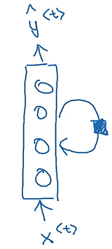
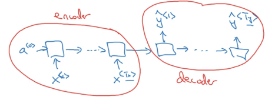
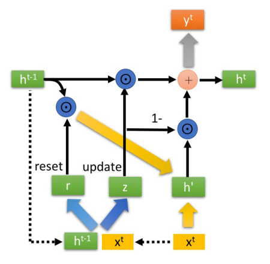
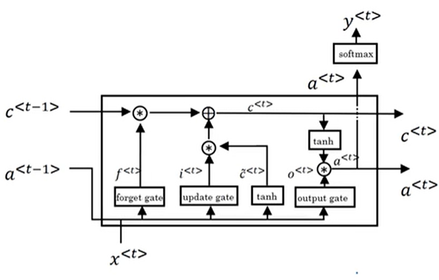

#! https://zhuanlan.zhihu.com/p/664337449
# 深度学习吴恩达老师课堂笔记（六）

续前面的[深度学习吴恩达老师课堂笔记（一）](https://zhuanlan.zhihu.com/p/663532574)、[深度学习吴恩达老师课堂笔记（二）](https://zhuanlan.zhihu.com/p/663689302)、[深度学习吴恩达老师课堂笔记（三）](https://zhuanlan.zhihu.com/p/663867959)、[深度学习吴恩达老师课堂笔记（四）](https://zhuanlan.zhihu.com/p/663943549)和[深度学习吴恩达老师课堂笔记（五）](https://zhuanlan.zhihu.com/p/664178942)继续学习吴恩达老师的课程，这一部分开始学习循环神经网络的内容：

## 5. 序列模型

### 5.1 循环神经网络(Recurrent Neural Network, RNN)

输入序列一般记作 $\boldsymbol{x}$，访问输入序列的固定下标一般使用$\boldsymbol{x}^{<t>}$，输入序列的长度一般使用 $T_x$ 来表示；同理，输入序列一般记作 $\boldsymbol{y}$，访问输入序列的固定下标一般使用 $\boldsymbol{y}^{<t>}$，输入序列的长度一般使用 $T_y$ 来表示。值得注意的就是不同的输入样本可能具有不相同的长度，表述具体某一个数据样本的某一个数据可以使用 $\boldsymbol{x}^{(i)<t>}$ 来表示，该样本的长度是 $T_x^{(i)}$。

实际上在表述输入的语句的时候很多网络会首先将语句划分成单词表里面的单词，然后使用一个列向量来替换这个单词，每个列向量的长度都和字典中的单词数相等，而只有在对应单词的位置对应元素是 1 其余位置都是0，我们将这种字典索引向量称为 One-hot Vector：

<!--  -->
通过上面的符号定义很容易就可以构建出监督学习网络的框架（输入 $\boldsymbol{x}$ 通过监督学习输出 $\boldsymbol{y}$），不过会遇到的问题就是不同的输入序列的长度可能并不一致，所以输入神经元的个数就不确定；其次，如果是按照常规神经元的连接方式，从文本不同位置上学习到特征并不共享；最后就是前面对于单词的编码格式决定了输入层体量非常大，进而决定着输入层的参数量非常非常大。为了解决序列预测中存在的这些问题提出了循环神经网络的结构：

<!--  -->
循环神经网络的输出是按照时间步进行的，对于每一个输入，网络都会预测一个输出，同时还会将本次输出对应的激活值保留在网络中，等待下一时刻网络的输入，有些时候这种结构也会被画成这种循环的格式：

<!--  -->
循环神经网络从左到右扫描输入序列，在每一个时间步上，网络的参数都是共享的，所以每一时刻的输出不仅取决于当前时刻的输入，还会取决于前面的输入，有点像 IIR 滤波器。显然这种结构的缺点也很明显，也就是网络在计算 t 时刻的输出时，只会考虑 t 时刻之前的输入，不会使用到 t 时刻之后的信息（因为还没被输入到网络中），为了解决这个问题需要提出双向 RNN 的概念，不过这里暂时还不会涉及到。

这里来看一下 RNN 的前向传播过程，其实基本过程和前面描述的很相似：
$$
\boldsymbol{a}^{<0>}=\boldsymbol{0}\\ \boldsymbol{a}^{<1>}=g_1(\boldsymbol{\omega}_{aa}\boldsymbol{a}^{<0>}+\boldsymbol{\omega}_{ax}\boldsymbol{x}^{<1>}+b_a)\\ \boldsymbol{\hat y}^{<1>}=g_2(\boldsymbol{\omega}_{ya}\boldsymbol{a}^{<1>}+b_y)\\ \vdots\\ \boldsymbol{a}^{<t>}=g_1(\boldsymbol{\omega}_{aa}\boldsymbol{a}^{<t-1>}+\boldsymbol{\omega}_{ax}\boldsymbol{x}^{<t>}+b_a)\\ \boldsymbol{\hat y}^{<t>}=g_2(\boldsymbol{\omega}_{ya}\boldsymbol{a}^{<t>}+b_y)\\
$$
<!-- $$
\boldsymbol{a}^{<0>}=\boldsymbol{0}\\
\boldsymbol{a}^{<1>}=g_1(\boldsymbol{\omega}_{aa}\boldsymbol{a}^{<0>}+\boldsymbol{\omega}_{ax}\boldsymbol{x}^{<1>}+b_a)\\
\boldsymbol{\hat y}^{<1>}=g_2(\boldsymbol{\omega}_{ya}\boldsymbol{a}^{<1>}+b_y)\\
\vdots\\
\boldsymbol{a}^{<t>}=g_1(\boldsymbol{\omega}_{aa}\boldsymbol{a}^{<t-1>}+\boldsymbol{\omega}_{ax}\boldsymbol{x}^{<t>}+b_a)\\
\boldsymbol{\hat y}^{<t>}=g_2(\boldsymbol{\omega}_{ya}\boldsymbol{a}^{<t>}+b_y)\\
$$ -->
在 RNN 中常见的激活函数是在 $g_1$ 部分使用 $\tanh$ 或者 $\text{ReLU}$ 函数而在 $g_2$ 部分使用 $\text{Sigmoid}$ 函数（用于 0-1 分类问题），上面的计算式最终可以被简写成这样：
$$
\boldsymbol{a}^{<t>}=g_1\left(\boldsymbol{W}_{a}\begin{bmatrix}\boldsymbol{a}^{<t-1>}\\\boldsymbol{x}^{<t>}\end{bmatrix}+b_a\right)\\ \boldsymbol{\hat y}^{<t>}=g_2(\boldsymbol{W}_{y}\boldsymbol{a}^{<t>}+b_y)\\
$$
RNN的前向传播流程就是这样的，接下来考虑一下反向传播过程，首先需要定义针对单个元素的损失函数：
$$
L^{<t>}(\boldsymbol{\hat y}^{<t>},\boldsymbol{y}^{<t>})=-\boldsymbol{y}^{<t>}\ln\boldsymbol{\hat y}^{<t>}-\left(1-\boldsymbol{y}^{<t>}\right)\ln\left(1-\boldsymbol{\hat y}^{<t>}\right)\\
$$
而整个序列的损失函数就是各个元素损失之和：
$$
L(\boldsymbol{\hat y},\boldsymbol{y})=\sum_{t=1}^{T_y}L^{<t>}(\boldsymbol{\hat y}^{<t>},\boldsymbol{y}^{<t>})\\
$$
接下来反向传播过程其实就和普通神经网络的推导方式一样了，这种反向传播有一个比较令人惊讶的名字就是“随时间反向传播”(Backpropagation Through Time, BPTT)，其实只是随着序列反向传播回去罢了。

前面讨论的 RNN 结构其实只能处理输入输出序列长度相等的情况，但是有很多问题输入输出序列长度并不相等，所以需要针对这个问题改进网络结构。首先刚刚处理的问题其实是多对多问题，首先再来考虑一种比较简单的情况也就是多对一情况——需要读取用户评价给出用户可能的评分，这就是输入一个序列输出一个数字；有时候也会出现一对多结构——使用一个关键词来生成一段音乐，网络结构可能是这样的：

<!--  -->
以及多对多问题——翻译问题中输入序列的长度可能和输出序列的长度不一样，可以考虑在输入语句结束以后进行输出，这样网络就被划分成 Encoder 和 Decoder 两个部分：

<!--  -->
总的来说，常见的RNN网络结构大体来说是这样的：

<!--  -->
语言模型的构建是RNN的一个重大应用场合，语言模型的主要任务就是计算某一中序列组合出现的概率（比如“我是学生”这个组合出现的概率就远高于“我是学牛”以及“我学是生”），这种计算在翻译等场合中非常常见。为了训练这样的语言模型，需要的训练集是大量的语言文本序列，这里的构建方式就是每个语句都使用若干One-hot Vector（表征语句中的每个单词）来构建，有些模型中还需要加入语句结束标识符 EOS(End of Sentence)和标点符号信息等。当然有的时候也会出现字典中没有出现过的句子，这种情况下可以考虑将该单词标记为未知\<UNK>，按照这种方式构建完输入序列以后就可以开始预测了。以 Cats average 15 hours of sleep a day.\<EOS> 这句话为例，第一步首先向网络输入第一个输入值为 $\boldsymbol{x}^{<1>}=\boldsymbol{0}$，上一次的激活值 $\boldsymbol{a}^{<0>}=\boldsymbol{0}$，于是网络计算出各个词出现的可能性最终通过Softmax层预测出可能的第一个单词 $\boldsymbol{\hat y}^{<1>}$，同时将此时的激活值 $\boldsymbol{a}^{<1>}$ 作为下一时刻的初始激活值，将下一时刻的输入选定为 $\boldsymbol{x}^{<2>}=\boldsymbol{y}^{<1>}$（**相当于这里告诉网络实际该句子第一个单词是Cat让网络预测第二个单词是什么**），依次循环，此时的网络输出其实是 $\boldsymbol{\hat y}^{<2>}=P(\textrm{average}|\textrm{Cat})$，最终到句子输入结束。这个过程中网络一直都可以获得在这个时间步之前的所有单词，需要完成的就是预测出这个时间步所对应的单词。我们可以针对每个时间步写出损失函数：
$$
L^{<t>}(\boldsymbol{\hat y}^{<t>},\boldsymbol{y}^{<t>})=-\sum_{i}y_i^{<t>}\ln\hat y_i^{<t>}\\
$$
总的代价函数为：
$$
J=\sum_{t}L^{<t>}(\boldsymbol{\hat y}^{<t>},\boldsymbol{y}^{<t>})\\
$$
这样就可以开始训练一个 RNN 网络了。在训练好一个 RNN 网络**生成模型**以后，一种检测网络行为的方法就是对网络进行新序列采样——首先在第一个时间步给网络输入零向量，然后在网络的输出上根据输出概率进行随机采样得到单词作为下一时间步的输入，依此循环往复得到输出序列一直到获得 EOS 标签为止。不过这种方法有的时候会输出 UNK 标志，这会导致输出结果并不完全合理，不过在这种输出框架下的唯一解决方案就是在采样的时候避开 UNK 标识符或者遇到UNK的时候重新采样。大概的输出模式就是这样的：

<!--  -->
不过还可以考虑构建字典的时候并不构建单词，而是只构建单个的英文字母，这样模型就不会遇到未知字符了，比如将字典构造成 $\{a,b,c,\dots,z,A,B,\dots,Z,\dots\}$ 的形式就不再会遇到 UNK 这种内容了，不过这样构建出来的模型就是基于字符的模型而不是基于单词的模型了。不过缺点就是会得到太多太长的序列进而导致模型捕获句子之间的依赖关系的能力下降，此外这种模型的计算成本比较高昂。

通常来说，RNN 模型很难捕获长语句前后的关系（比如动词是否应该使用第三人称单数形式，在句子很长的时候网络很容易犯错误），这是因为梯度消失导致的长语句前后部分的关联性很弱导致的。在 RNN 中梯度爆炸很容易发现（输出 NaN 等）也比较容易解决——比如使用梯度修剪方法，当梯度大于某个阈值以后通过一些最大值来修剪梯度，但是梯度消失的问题比较难处理。（这里受到一个 up 主启发，重新说明一下这里的梯度消失问题：对于 RNN 网络而言，梯度消失问题体现在网络链比较长的时候梯度由于连乘效应**变为零**这个说法并不准确；对于 RNN 网络而言，它的梯度其实被定义为各个时间步上的梯度和，因此正确的说法应该是体现为**梯度下降过程被近距离梯度阻挡、远距离梯度被忽略不计**。）一般而言会采用 GRU(Gated Recurrent Unit, 门控循环单元)来解决，GRU 的主要思路就是在 RNN 中引入记忆单元来帮助网络记忆长跨度信息，这里的记忆单元的记忆方式就是：
$$
c^{<t>}=a^{<t>}\\ \tilde c^{<t>}=g\left(\boldsymbol{W}_{c}\begin{bmatrix}\boldsymbol{c}^{<t-1>}\\\boldsymbol{x}^{<t>}\end{bmatrix}+b_c\right)\\
$$
<!-- $$
c^{<t>}=a^{<t>}\\
\tilde c^{<t>}=g\left(\boldsymbol{W}_{c}\begin{bmatrix}\boldsymbol{c}^{<t-1>}\\\boldsymbol{x}^{<t>}\end{bmatrix}+b_c\right)\\
$$ -->
不过这个记忆单元并不是每次都会记忆新的内容，这里就引出了所谓的“门”的概念，这里构造了一个阈值函数：
$$
\Gamma_u=\textrm{Sigmoid}\left(\boldsymbol{W}_{u}\begin{bmatrix}\boldsymbol{c}^{<t-1>}\\\boldsymbol{x}^{<t>}\end{bmatrix}+b_u\right)\\
$$
这个阈值结果会作用于记忆结果：
$$
c^{<t>}=\Gamma_u\tilde c^{<t>}+(1-\Gamma_u)c^{<t-1>}\\
$$
为了使这个记忆单元发挥该有的记忆作用，这里的 $\Gamma_u$ 的结果一般非常接近 0 或者 1，也就是几乎呈现出门开启或者关闭的二值状态。不过实际上完整的标准形式的GRU还有另一个阈值来表征上一次记忆结果与当前输出值的相似程度，最终的运算流程是这样的：
$$
\vdots\\ \textrm{}\\ \boldsymbol{\Gamma}_r=\textrm{Sigmoid}\left(\boldsymbol{W}_{r}\begin{bmatrix}\boldsymbol{c}^{<t-1>}\\\boldsymbol{x}^{<t>}\end{bmatrix}+b_r\right)\\ \boldsymbol{\tilde c}^{<t>}=g\left(\boldsymbol{W}_{c}\begin{bmatrix}\boldsymbol{\Gamma}_r\odot\boldsymbol{c}^{<t-1>}\\\boldsymbol{x}^{<t>}\end{bmatrix}+b_c\right)\\ \boldsymbol{\Gamma}_u=\textrm{Sigmoid}\left(\boldsymbol{W}_{u}\begin{bmatrix}\boldsymbol{c}^{<t-1>}\\\boldsymbol{x}^{<t>}\end{bmatrix}+b_u\right)\\ \boldsymbol{c}^{<t>}=\boldsymbol{\Gamma}_u\odot\boldsymbol{\tilde c}^{<t>}+(\boldsymbol{1}-\boldsymbol{\Gamma}_u)\odot\boldsymbol{c}^{<t-1>}\\ \vdots\\
$$
<!-- $$
\vdots\\ \textrm{}\\
\boldsymbol{\Gamma}_r=\textrm{Sigmoid}\left(\boldsymbol{W}_{r}\begin{bmatrix}\boldsymbol{c}^{<t-1>}\\\boldsymbol{x}^{<t>}\end{bmatrix}+b_r\right)\\
\boldsymbol{\tilde c}^{<t>}=g\left(\boldsymbol{W}_{c}\begin{bmatrix}\boldsymbol{\Gamma}_r\odot\boldsymbol{c}^{<t-1>}\\\boldsymbol{x}^{<t>}\end{bmatrix}+b_c\right)\\
\boldsymbol{\Gamma}_u=\textrm{Sigmoid}\left(\boldsymbol{W}_{u}\begin{bmatrix}\boldsymbol{c}^{<t-1>}\\\boldsymbol{x}^{<t>}\end{bmatrix}+b_u\right)\\
\boldsymbol{c}^{<t>}=\boldsymbol{\Gamma}_u\odot\boldsymbol{\tilde c}^{<t>}+(\boldsymbol{1}-\boldsymbol{\Gamma}_u)\odot\boldsymbol{c}^{<t-1>}\\
\vdots\\
$$ -->
这里的 $\boldsymbol{\Gamma}_r$ 决定的是是否需要记忆新的数据，当他趋于 0 的时候说明上一时刻的内容需要全部丢弃，只保留当前时刻的输入，所以可以用来丢弃与预测无关的历史信息；反之当它趋于 1 的时候表示完全保留上一时刻的隐藏状态，因此它也被称为重置门，有助于捕捉时间序列里短期的依赖关系。

同理 $\boldsymbol{\Gamma}_u$ 用于控制前一时刻的状态信息被带入到当前状态中的程度，也就是更新门帮助模型决定到底要将多少过去的信息传递到未来，简单来说就是用于更新记忆。因此它也被称为**更新门**。GRU 就是通过这两个门来实现的记忆更新，这里的 c 其实也就是实际网络的输出 y。网上常见的符号体系与上面的这一套不一致，不过可以参看一下大致的步骤：

<!--  -->
除了 GRU 以外，还有一种比较常见的用于解决梯度消失的网络结构就是 LSTM(Long Short Term Memory, 长短期记忆)，它相比 GRU 提出得更早，参数量也更大，不过两者的效果差不多。有些时候 LSTM 在记忆部分能够做得比 GRU 更好，它相比 GRU 多了一个门，它的更新方式是这样的：
$$
\vdots\\ \boldsymbol{\tilde c}^{<t>}=\tanh\left(\boldsymbol{W}_c \begin{bmatrix} \boldsymbol{a}^{<t-1>} \\ \boldsymbol{x}^{<t>} \end{bmatrix} +b_c\right)\\ \boldsymbol{\Gamma}_u=\sigma\left(\boldsymbol{W}_u \begin{bmatrix} \boldsymbol{a}^{<t-1>} \\ \boldsymbol{x}^{<t>} \end{bmatrix} +b_u\right)\\ \textrm{}\\ \boldsymbol{\Gamma}_f=\sigma\left(\boldsymbol{W}_f \begin{bmatrix} \boldsymbol{a}^{<t-1>} \\ \boldsymbol{x}^{<t>} \end{bmatrix} +b_f\right)\\ \textrm{}\\ \boldsymbol{\Gamma}_o=\sigma\left(\boldsymbol{W}_o \begin{bmatrix} \boldsymbol{a}^{<t-1>} \\ \boldsymbol{x}^{<t>} \end{bmatrix} +b_o\right)\\ \textrm{}\\ \boldsymbol{c}^{<t>}=\boldsymbol{\Gamma}_u\odot\boldsymbol{\tilde c}^{<t>}+\boldsymbol{\Gamma}_f\odot\boldsymbol{\tilde c}^{<t-1>}\\ \boldsymbol{a}^{<t>}=\boldsymbol{\Gamma}_o\odot\tanh\boldsymbol{c}^{<t>}\\ \vdots\\
$$
<!-- $$
\vdots\\
\boldsymbol{\tilde c}^{<t>}=\tanh\left(\boldsymbol{W}_c
\begin{bmatrix}
\boldsymbol{a}^{<t-1>} \\ \boldsymbol{x}^{<t>}
\end{bmatrix}
+b_c\right)\\
\boldsymbol{\Gamma}_u=\sigma\left(\boldsymbol{W}_u
\begin{bmatrix}
\boldsymbol{a}^{<t-1>} \\ \boldsymbol{x}^{<t>}
\end{bmatrix}
+b_u\right)\\ \textrm{}\\
\boldsymbol{\Gamma}_f=\sigma\left(\boldsymbol{W}_f
\begin{bmatrix}
\boldsymbol{a}^{<t-1>} \\ \boldsymbol{x}^{<t>}
\end{bmatrix}
+b_f\right)\\ \textrm{}\\
\boldsymbol{\Gamma}_o=\sigma\left(\boldsymbol{W}_o
\begin{bmatrix}
\boldsymbol{a}^{<t-1>} \\ \boldsymbol{x}^{<t>}
\end{bmatrix}
+b_o\right)\\ \textrm{}\\
\boldsymbol{c}^{<t>}=\boldsymbol{\Gamma}_u\odot\boldsymbol{\tilde c}^{<t>}+\boldsymbol{\Gamma}_f\odot\boldsymbol{\tilde c}^{<t-1>}\\
\boldsymbol{a}^{<t>}=\boldsymbol{\Gamma}_o\odot\tanh\boldsymbol{c}^{<t>}\\ \vdots\\
$$ -->
这里使用的三个门分别被称为更新(Update)门、遗忘(Forget)门和输出(Output)门，整体算法结构大概是这样的：

<!--  -->

<!--  -->
通过这种框图可以很容易发现神经元之间除了传递 $\boldsymbol{a}^{<t>}$ 以外还会传递 $\boldsymbol{c}^{<t>}$，可以很容易地通过上述框图意识到神经元的记忆方式。

上面的结构还是具有改进空间，主要就是[当前的细胞状态不能影响到三个门在下一时刻的输出，使整个细胞状态对上一单元模块的序列处理中丢失了部分信息，因此在内部网络结构中加入了窥孔连接，该连接可以让门观察到细胞状态](https://blog.csdn.net/weixin_55575757/article/details/128065468)。因此需要将网络更新迭代的结构改成这样：
$$
\vdots\\ \boldsymbol{\tilde c}^{<t>}=\tanh\left(\boldsymbol{W}_c \begin{bmatrix} \boldsymbol{a}^{<t-1>} \\ \boldsymbol{x}^{<t>} \end{bmatrix} +b_c\right)\\ \textrm{}\\ \boldsymbol{\Gamma}_u=\sigma\left(\boldsymbol{W}_u \begin{bmatrix} \boldsymbol{c}^{<t-1>} \\ \boldsymbol{a}^{<t-1>} \\ \boldsymbol{x}^{<t>} \end{bmatrix} +b_u\right)\\ \textrm{}\\ \boldsymbol{\Gamma}_f=\sigma\left(\boldsymbol{W}_f \begin{bmatrix} \boldsymbol{c}^{<t-1>} \\ \boldsymbol{a}^{<t-1>} \\ \boldsymbol{x}^{<t>} \end{bmatrix} +b_f\right)\\ \textrm{}\\ \boldsymbol{\Gamma}_o=\sigma\left(\boldsymbol{W}_o \begin{bmatrix} \boldsymbol{c}^{<t-1>} \\ \boldsymbol{a}^{<t-1>} \\ \boldsymbol{x}^{<t>} \end{bmatrix} +b_o\right)\\ \textrm{}\\ \boldsymbol{c}^{<t>}=\boldsymbol{\Gamma}_u\odot\boldsymbol{\tilde c}^{<t>}+\boldsymbol{\Gamma}_f\odot\boldsymbol{\tilde c}^{<t-1>}\\ \boldsymbol{a}^{<t>}=\boldsymbol{\Gamma}_o\odot\tanh\boldsymbol{c}^{<t>}\\ \vdots\\
$$
<!-- $$
\vdots\\
\boldsymbol{\tilde c}^{<t>}=\tanh\left(\boldsymbol{W}_c
\begin{bmatrix}
\boldsymbol{a}^{<t-1>} \\ \boldsymbol{x}^{<t>}
\end{bmatrix}
+b_c\right)\\ \textrm{}\\
\boldsymbol{\Gamma}_u=\sigma\left(\boldsymbol{W}_u
\begin{bmatrix}
\boldsymbol{c}^{<t-1>} \\ \boldsymbol{a}^{<t-1>} \\ \boldsymbol{x}^{<t>}
\end{bmatrix}
+b_u\right)\\ \textrm{}\\
\boldsymbol{\Gamma}_f=\sigma\left(\boldsymbol{W}_f
\begin{bmatrix}
\boldsymbol{c}^{<t-1>} \\ \boldsymbol{a}^{<t-1>} \\ \boldsymbol{x}^{<t>}
\end{bmatrix}
+b_f\right)\\ \textrm{}\\
\boldsymbol{\Gamma}_o=\sigma\left(\boldsymbol{W}_o
\begin{bmatrix}
\boldsymbol{c}^{<t-1>} \\ \boldsymbol{a}^{<t-1>} \\ \boldsymbol{x}^{<t>}
\end{bmatrix}
+b_o\right)\\ \textrm{}\\
\boldsymbol{c}^{<t>}=\boldsymbol{\Gamma}_u\odot\boldsymbol{\tilde c}^{<t>}+\boldsymbol{\Gamma}_f\odot\boldsymbol{\tilde c}^{<t-1>}\\
\boldsymbol{a}^{<t>}=\boldsymbol{\Gamma}_o\odot\tanh\boldsymbol{c}^{<t>}\\ \vdots\\
$$ -->
这种结构常被称为“窥视孔连接”。

接下来讨论一下另一种 RNN 网络，他也被称为“双向循环神经网络”(Bidirectional RNN, or Bi-RNN, BRNN)，它能够实现在序列的某个位置同时能够获取当前时间步之前和之后的信息；这一点需求在前面已经提到过，可以在序列前长度比较短的时候实现比较高准确率的预测。它实质上就是构造了两条信号通路来实现信号的双向流通，不过代价就是会增加一组神经元，这就是它的网络结构图（**注意图中的神经元不仅可以是简单的 RNN 神经元还可以是 GRU 或者 LSTM 单元**）：

<!--  -->

<!--  -->
此时的输出单元的计算表达式就应该写成：
$$
\boldsymbol{\hat y}^{<t>}=g(\boldsymbol{W}_{y}\begin{bmatrix} {\mathop{\boldsymbol{a}}\limits^{\leftarrow}}^{<t>} \\ {\mathop{\boldsymbol{a}}\limits^{\rightarrow}}^{<t>} \end{bmatrix}+b_y)\\
$$
到此为止已经学习了很多的 RNN 算法，不过为了让 RNN 能够学习到更加深层更加复杂的特征，通常会使用深度 RNN 网络，首先来回顾一下 RNN 网络的结构：

<!--  -->
可以写一下 $\boldsymbol{a}^{[2]<3>}$ 神经元的计算公式：
$$
\boldsymbol{a}^{[2]<3>}=g\left(\boldsymbol{W}_a^{[2]}\begin{bmatrix} \boldsymbol{a}^{[2]<2>} \\ \boldsymbol{a}^{[1]<3>} \end{bmatrix}+b_a^{[2]}\right)\\
$$
当然这里的神经元也没有必要一定得是标准的 RNN 神经元，其实也可以是 LSTM 或者 GRU 神经元，可以发现，由于横向的时间步之间的连接存在， RNN 神经网络的推理速度其实是比较慢的。当然深层 RNN 可以不断叠加这种具有水平连接的网络层，不过更常规的做法是在这种 RNN 层以后连接互相独立的、没有水平连接的深度神经网络层：

<!--  -->

限于篇幅影响，这一部分到这里就结束了，下一部分会继续讲述有关嵌入的内容。
