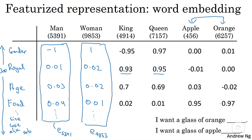
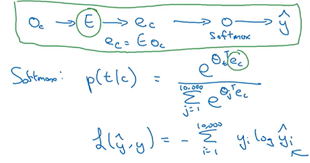
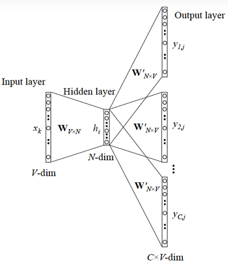
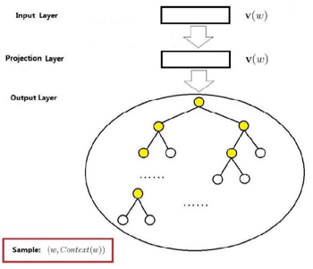
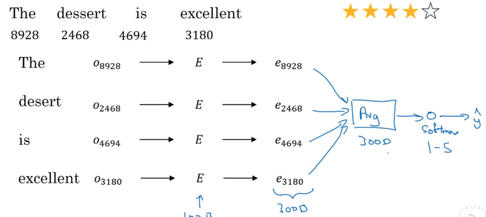
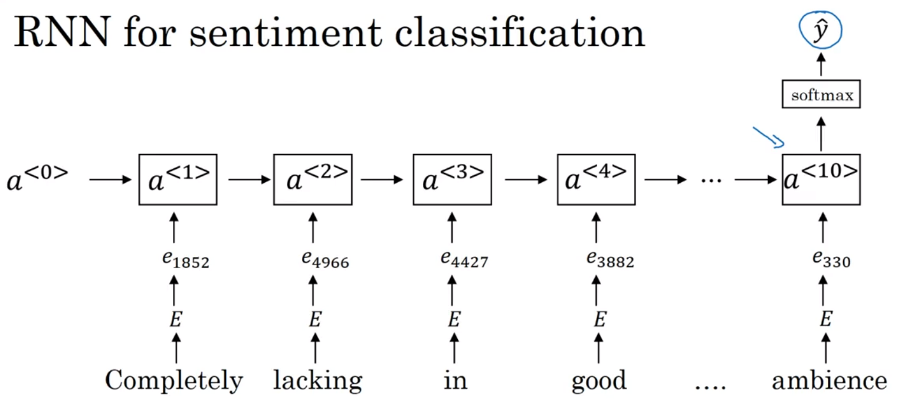

# 深度学习吴恩达老师课堂笔记（七）

## 5. 序列模型

### 5.2 自然语言处理和词嵌入
目前为止都是使用一个 One-hot 向量$O_i$来表述一个单词，这种方式存在的问题就是这样训练出来的网络对于相关词语的泛化能力不强（主要原因就是任意两个不相等的 One-hot 向量之间的内积都是零，因此网络不能从 One-hot 向量中获得词语的相关信息）。这里的解决方案就是转而构造若干特征，使用特征向量来描述一个单词：

使用这种特征向量描述方式训练出来的网络在泛化能力上明显是要优于使用 One-hot 向量的网络的。此外，在 NLP 领域，通过这种方式构造出来的特征向量有的时候也会通过一些手段降维到可视化空间（聚类、 PCA ......），这种过程也被称为**单词嵌入(Word embedding)**。这里的单词嵌入和前面在学习卷积神经网络的时候学到的*编码*概念很相似（可以去回顾一下人脸识别任务），其实在很大程度上，这里的*嵌入*和*编码*表达的就是相同含义。

实际上的单词嵌入任务在开发的时候会结合*迁移学习*来实现，比如下面的任务结构：

1. 从大量的文本集(100万-1亿量级)中学习各种单词的特征（进行单词嵌入）；
   当然也可以直接从网上下载预训练好的嵌入网络
2. 将嵌入好的网络迁移到需要使用的任务中，此时就可以使用更小的数据集(比如10万个单词)进行训练
   好处就是可以在这个过程中获得更加紧凑的向量（最终是要将特征向量压缩成 One-hot 向量）
3. 当然也可以在新的数据上选择是不是还要对模型进行微调

单词嵌入还有一个比较好的特性就是可以实现**类比推理**，比如现在有四个单词，嵌入以后结果为
$$
\boldsymbol{e}_{1000}, \boldsymbol{e}_{1005}, \boldsymbol{e}_{1500}, \boldsymbol{e}_{1520}\\
$$
如果我们已知这四个向量满足特性的关系：
$$
\boldsymbol{e}_{1520}-\boldsymbol{e}_{1000}\approx\boldsymbol{e}_{1005}-\boldsymbol{e}_{1500}\\
$$
而且已知在很大程度上$\boldsymbol{e}_{1005}$和$\boldsymbol{e}_{1500}$对应的单词是非常相似的（比如 man 和 woman），那么我们就可以得出$\boldsymbol{e}_{1000}$和$\boldsymbol{e}_{1520}$对应的单词也非常相似的结论，这就是单词嵌入带来的类比推理功能。实际上，如果给定前三个单词，那么该算法需要实现的就是：
$$
\min_{w}\textrm{Similarity}(\boldsymbol{e}_w,\boldsymbol{e}_{1000}-\boldsymbol{e}_{1005}+\boldsymbol{e}_{1500})\\
$$
研究者的研究结果表明，在嵌入体量非常大的情况下（嵌入以后的特征向量维数很高），只要这两个向量能达到30%-75%的相似度，结果就基本可以让人满意了。

在实际使用过程中，这里的相似度函数可能会取为向量之间的夹角：
$$
\textrm{Similarity}(\boldsymbol{u},\boldsymbol{v})=\arccos\frac{\boldsymbol{u}^T\boldsymbol{v}}{||\boldsymbol{u}||_2||\boldsymbol{v}||_2}\\
$$
当然其实也可以使用向量末端点之间的距离，不过这里不再赘述了。

实际上我们通过单词嵌入构造出来的是一个**嵌入矩阵(Embedding matrix)**，比如总共有 10000 个单词提取 300 个特征，最后得到的就是一个 300×10000 大小的矩阵$\boldsymbol{E}$，不难发现将嵌入矩阵和之前定义的 One-hot 向量相乘，得到的就是对应单词在嵌入以后的特征向量：
$$
\boldsymbol{e}_i=\boldsymbol{E}\boldsymbol{O}_i\\
$$
不过值得注意的就是由于矩阵的稀疏性（One-hot 向量中绝大多数元素都是 0），**在这里使用矩阵乘法的效率其实非常低**，不过在习惯上还是会使用这种数学表述来获得某一个单词的特征向量。

接下来就是训练我们需要的嵌入矩阵了。实际上这里构造学习嵌入矩阵的方式并不是使用 RNN 网络，而是使用一个监督学习网络来训练。比如有一个句子，现在需要做得就是从句子中随机抽取一个单词，试图通过监督学习网络来预测这个句子中的前 5 个或者后 5 个单词中的一个（网络没有得到其他的上下文环境），也就是该网络的数据就是一个 One-hot 向量，输出层是一个 Softmax 层期望输出另一个 One-hot 向量。

训练的时候这个网络只有两个层——输入层、一个*无激活*的隐藏层和 Softmax 输出层，这里使用的就是 Skip-gram 模型，这是 Word2Vec 模型的一种（还有一种比较常用的就是 CBOW, 它和 Skip-gram 的区别其实就在于前者是输入上下文预测一个单词后者是输入一个单词预测上下文，实际做法是相似的，这一点可以在后面的部分参考链接中看到），大致的网络结构是这样的：

它主要有两组权重矩阵$\boldsymbol{W}^{[1]},\boldsymbol{W}^{[2]}$，实际计算的时候就是输入一个 One-hot 向量通过$\boldsymbol{W}^{[1]}$(其实也就是我们需要的权重矩阵$\boldsymbol{E}$)计算出隐藏层神经元：
$$
\boldsymbol{h}=\boldsymbol{W}^{[1]}\boldsymbol{o}_c\\
$$
接下来通过一个共享的权重矩阵$\boldsymbol{W}^{[2]}$计算出 Softmax 层的输出：
$$
\boldsymbol{u}=\boldsymbol{W}^{[2]}\boldsymbol{h}\\
$$
接下来将这个结果进行激活也就是送到一个 Softmax 层中，就可以得到用于计算代价的归一化概率向量：
$$
y_j=\frac{e^{\boldsymbol{u}_j}}{\displaystyle\sum_{i=1}^V e^{\boldsymbol{u}_i}}\\
$$
然后定义这里的损失函数为：
$$
L(\boldsymbol{\hat y},\boldsymbol{y})=\sum_{i=1}^C y_i\ln\hat y_i\\
$$
于是就可以通过反向传播梯度下降的方法来优化这两个权重矩阵了，最终得到的第一个权重矩阵就是我们要的嵌入矩阵(上面这一部分内容除了看视频还参考了链接[深入浅出Word2Vec原理解析](https://zhuanlan.zhihu.com/p/114538417)，还有一个有数学计算过程的[【图文并茂】通过实例理解word2vec之Skip-gram](https://zhuanlan.zhihu.com/p/215797088)也讲得不错)。

实际上 Skip-gram 或者说 Word2Vec 最终需要完成的内容并不是实现比较准确的预测词语，而是缕顺某一句话是不是通顺（就像前面的例子，“我生是学”明显是一个不通顺的句子，正常的应该是“我是学生”，单词嵌入就是通过完成这种任务来捕捉不同词语构成句子的规律方法，从而**总结出词性等特征实现降维**）(这一部分可以参看链接[[NLP] 秒懂词向量Word2vec的本质](https://zhuanlan.zhihu.com/p/26306795)，讲得比较清楚)。

不过，由于需要降维的单词数量其实非常多（前面已经说过，这个网络的输出都是 One-hot 向量，因此输入输出维度都和字典中的单词数量相同），因此上面的网络需要进行的运算量是非常大的，为此研究人员提出了加快训练的方法，主要就是 Hierarchical Softmax 和 Negative Sampling.接下来大致介绍一下这两个快速训练的算法。(下面的部分主要还是借鉴了[深入浅出Word2Vec原理解析](https://zhuanlan.zhihu.com/p/114538417)):

***
#### 5.2.1 基于 Hierarchical Softmax 的 Skip-gram
Hierarchical Softmax 其实就是通过数据结构的手段将这样一个多分类问题划分成很多个二分类问题来解决的，通过构建 Hoffman 二叉树将高频出现的词语放在浅层节点、将低频出现的词语放在深层节点，这样就可以在搜索的时候大幅度提高速度(甚至高于完全平衡二叉树)：

实际上，该二叉树的每个节点都对应着一个二分类问题，而每个末端节点都对应着一个单词（或者说 One-hot 向量），这样每个单词就对应 Hoffman 二叉树的一条唯一搜索路径，因而也就对应着一个唯一确定的概率（因为一路下来都是二分类，因此这个概率其实已经归一化过了）。比如现在使用$p^w$代表从根节点出发到达单词 w 的路径，用$l^w$代表路径$p^w$中包含节点的个数，$p^w_1,p^w_2,\dots,p^w_{l^w}$代表该路径上的各个节点，其中$p^w_1$代表根节点，$p^w_{l^w}$代表单词 w 所对应的节点，$d_2^w,d_3^w,\dots,d_{l^w}^w\in\{0,1\}$代表每个节点在其父节点的分类结果（左节点 or 右节点）（很显然根节点无法划分该结果所以下标是从 2 开始的），而$\boldsymbol{\theta}_1^w,\boldsymbol{\theta}_2^w,\dots,\boldsymbol{\theta}_{l^w}^w$代表该路径上非叶子节点（就是不处于末端的节点）的参数向量，就是二分类的时候用的向量。于是，如果隐藏层输出的是向量$\boldsymbol{v_w}$（其实就是嵌入矩阵中的一列$\boldsymbol{e_w}$）的话,对于每个节点来说，进行二分类的时候被分为正类的概率就是：
$$
\sigma(\boldsymbol{v}_w^T\boldsymbol{\theta}^w_i)=\frac{1}{1+e^{-\boldsymbol{v}_w^T\boldsymbol{\theta}^w_i}}\\
$$
于是从根节点出发到达某一个词 u 的概率就是沿路二分类问题分类概率之积：
$$
\begin{align*} p(d_j^u|\boldsymbol{v}(w),\boldsymbol{\theta}_{j-1}^u)&=\begin{cases} \sigma(\boldsymbol{v}_w^T\boldsymbol{\theta}^u_{j-1})\qquad, d_j^u=0,\\ 1-\sigma(\boldsymbol{v}_w^T\boldsymbol{\theta}^u_{j-1}) \ ,d_j^u=1. \end{cases}\\ &=\left[\sigma(\boldsymbol{v}_w^T\boldsymbol{\theta}^u_{j-1})\right]^{1-d_j^u}\cdot\left[1-\sigma(\boldsymbol{v}_w^T\boldsymbol{\theta}^u_{j-1})\right]^{d_j^u} \end{align*}\\
$$
<!-- $$
\begin{align*}
p(d_j^u|\boldsymbol{v}(w),\boldsymbol{\theta}_{j-1}^u)&=\begin{cases}
\sigma(\boldsymbol{v}_w^T\boldsymbol{\theta}^u_{j-1})\qquad, d_j^u=0,\\
1-\sigma(\boldsymbol{v}_w^T\boldsymbol{\theta}^u_{j-1}) \ ,d_j^u=1.
\end{cases}\\
&=\left[\sigma(\boldsymbol{v}_w^T\boldsymbol{\theta}^u_{j-1})\right]^{1-d_j^u}\cdot\left[1-\sigma(\boldsymbol{v}_w^T\boldsymbol{\theta}^u_{j-1})\right]^{d_j^u}
\end{align*}
$$ -->
重新梳理一下现在进行的任务是已知单词 w 计算词库中某个单词 u 出现在其上下文的概率，于是从根节点出发进行二分类到单词最终的概率就是：
$$
p(u|w)=\prod_{j=2}^{l^u}p(d_j^u|\boldsymbol{v}(w),\boldsymbol{\theta}_{j-1}^u)\\
$$
于是可以写出损失函数为：
$$ \begin{align*} L&=-\sum_{w\in C}\ln\prod_{u\in \textrm{Context}(w)}\prod_{j=2}^{l^u}\left[\sigma(\boldsymbol{v}_w^T\boldsymbol{\theta}^u_{j-1})\right]^{1-d_j^u}\cdot\left[1-\sigma(\boldsymbol{v}_w^T\boldsymbol{\theta}^u_{j-1})\right]^{d_j^u}\\ &=-\sum_{w\in C}\sum_{u\in \textrm{Context}(w)}\sum_{j=2}^{l^u}\left[(1-d_j^u)\ln\sigma(\boldsymbol{v}_w^T\boldsymbol{\theta}^u_{j-1})+d_j^u\ln\left(1-\sigma(\boldsymbol{v}_w^T\boldsymbol{\theta}^u_{j-1})\right)\right] \end{align*}
$$
<!-- $$
\begin{align*}
L&=-\sum_{w\in C}\ln\prod_{u\in \textrm{Context}(w)}\prod_{j=2}^{l^u}\left[\sigma(\boldsymbol{v}_w^T\boldsymbol{\theta}^u_{j-1})\right]^{1-d_j^u}\cdot\left[1-\sigma(\boldsymbol{v}_w^T\boldsymbol{\theta}^u_{j-1})\right]^{d_j^u}\\
&=-\sum_{w\in C}\sum_{u\in \textrm{Context}(w)}\sum_{j=2}^{l^u}\left[(1-d_j^u)\ln\sigma(\boldsymbol{v}_w^T\boldsymbol{\theta}^u_{j-1})+d_j^u\ln\left(1-\sigma(\boldsymbol{v}_w^T\boldsymbol{\theta}^u_{j-1})\right)\right]
\end{align*}
$$ -->
于是就可以使用梯度下降的方法写出总的代价函数相对于节点中的每个参数以及前级网络输出$\boldsymbol{v}_w$的代价函数了，从而就可以进行梯度下降了，不再赘述。

#### 5.2.2 基于 Negative Sampling 的 Skip-gram

关于使用负采样的原因这篇文档讲得比较清楚：[理解 Word2Vec 之 Skip-Gram 模型](https://zhuanlan.zhihu.com/p/27234078)。

和前面不同的是，负采样方法对于降低计算量的考量就不再是通过强大的数据结构来管理数据了，而是通过随机采样的方法来等效实现。首先可以肯定的是完全随机的采样的最终效果显然是不好的，因为肯定会存在一部分单词(and or the of...)的出现频率远高于其他实词，首先对于这种样本的训练并不能在帮助网络理解语言上提高太大帮助，另一方面这种样本可能会样本的绝大多数，所以这里选择的方法就是按照出现频率进行采样（即选择一种随机采样的规则使得出现频率高的单词被随机采样到的可能性更低）。

对于这个问题研究者给出的解决思路就是对于我们在训练原始文本中遇到的每一个单词，它们都有一定概率被我们从文本中删掉，而这个被删除的概率与单词的频率有关。实际上使用的抽样公式就是：
$$
P=\left(\sqrt{\frac{Z(w)}{0.001}}+1\right)\times\frac{0.001}{Z(w)}\\
$$
这里的$f(w)$实际上对应的就是单词 w 在语料 C 中的出现频率，这里的 0.001 是一个超参数；而计算出来的 P 代表的是单词 w 被保留的概率。对于一个庞大的语料来说，单个单词的出现频率不会很大，即使是常用词，也不可能特别大。这里的第一次抽样完成的动作是直接从语料中删除单词，也就是被删除的单词已经不会再被作为后面的中心词了也永远不会成为其他单词的上下文单词。

然后才是实际上的负采样过程，前面已经说过，巨大的字典导致的是 Skip-gram 神经网络会拥有一个巨大无比的权重矩阵从而拖慢训练速度，而负采样**每次让一个训练样本仅仅更新一小部分的权重**，这样就会降低梯度下降过程中的计算量。

> 当我们用训练样本 (input word: "fox"，output word: "quick") 来训练我们的神经网络时，" fox" 和 "quick" 都是经过 One-hot 编码的。如果我们的字典大小为 10000，在输出层，我们期望对应 "quick" 单词的那个神经元结点输出 1，其余 9999 个都应该输出 0。在这里，这 9999 个我们期望输出为 0 的神经元结点所对应的单词我们称为 "negative" word。

当使用负采样时，我们**将随机选择一小部分的 negative words（比如选 5 个 negative words）来更新对应的权重**。我们也会对我们的 "positive" word 进行权重更新（在我们上面的例子中，这个单词指的是 "quick"）。一般来说在数据集比较小的时候将 K 选定为 5-20 比较好，如果数据集够大的话就可以选 2-5 个。而这里的选择 negative words 的过程就是**负采样**。通过这种方式我们就可以标注出类似这样的数据集（标签就是这两个单词是否处于上下文中，至于上下文的定义这里其实还有一个参数是 Span，这里也不多说了）：

> 比如我们的隐层-输出层拥有$300\times10000$的权重矩阵。如果使用了负采样的方法我们仅仅去更新我们的 positive word-"quick" 的和我们选择的其他 5 个 negative words 的结点对应的权重，共计 6 个输出神经元，相当于每次只更新个$300\times6=1800$权重。对于3百万的权重来说，相当于只计算了0.06%的权重，这样计算效率就大幅度提高。

通过这种负采样的方式，我们构建的网络的数据集和训练回归需要的计算量就大大减小了，因为原来是需要在任意两个单词之间构建回归的，现在只需要在少数的单词之间进行回归就可以了，有点像协同训练的概念。

这里可以展开说说负采样的具体实现，首先需要统计一个文本集合 C 中各个单词的出现频率：
$$
f(w)=Z(w)=\frac{\textrm{Count}(w)}{\displaystyle\sum_{u\in C}\textrm{Count}(u)}\\
$$
这里的$\textrm{Count}(w)$表征的就是单词 w 在语料 C 中的出现频次。在随机的时候可以固定一种词典中所有单词的一种全排列，按照各个单词的出现频次将实数区间[0,1]划分成若干段，每一段都对应一个单词，而每一段的长度都等于该单词的出现频次。在抽样的时候需要随机一个[0,1]之间的实数，找到它对应的是哪一个单词就实现了按照出现频次进行抽样。出现频次较高的单词被抽中的几率更大。

不过实际上算法运行是通过其他手段映射到整数域进行随机的，但是思路是一样的。不过原论文中还有一个细节就是实际上在构造“频次”的时候，使用的是这样的一个式子：
$$
f(w)=\frac{\textrm{Count}(w)^\alpha}{\displaystyle\sum_{u\in C}\textrm{Count}(u)^\alpha}\\
$$
最后选定$\alpha=0.75$，是研究者尝试了不同的参数发现这样的效果比较好。

构建了数据集以后就可以构建一个逻辑回归模型，输入变量是给定中心词 w 和词典中的其他单词 u，输出是他们两个处于同一上下文的概率：
$$
P(u\in\textrm{Context}(w)|w)=P(y=1|w,u)=\sigma(\boldsymbol{v}_{w}^T\boldsymbol{\theta}^u)\\
$$
于是，在给定标签$y^w(u)$的情况下可以写出给定中心词 w 时单词 u 的损失函数：
$$
\begin{align*} L(u|w)&=\begin{cases} \sigma(\boldsymbol{v}_{w}^T\boldsymbol{\theta}^u),\qquad y^w(u)=1,\\ 1-\sigma(\boldsymbol{v}_{w}^T\boldsymbol{\theta}^u), \ \ y^w(u)=0. \end{cases}\\ &=\left[\sigma(\boldsymbol{v}_{w}^T\boldsymbol{\theta}^u)\right]^{y^w(u)}\cdot\left[1-\sigma(\boldsymbol{v}_{w}^T\boldsymbol{\theta}^u)\right]^{1-y^w(u)} \end{align*}\\
$$
于是在给定语句 q 时写出的最优化目标是（理解上就是需要最大化窗口中上下文单词的出现概率）：
$$
\max\prod_{\widetilde w\in q}\prod_{u\in(w\cup\textrm{NEU}^{\widetilde{w}}(q))}L(u|\widetilde{w})\\ \iff\min\sum_{\widetilde w\in q}\sum_{u\in(w\cup\textrm{NEU}^{\widetilde{w}}(q))}-\ln L(u|\widetilde{w})\\
$$
其中$\textrm{NEU}^{\widetilde{w}}(q)$是针对单词$\widetilde{w}$生成的负样本子集，因此整体来说最终的代价函数就选取为：
$$
J=\sum_{q\in C}\sum_{\widetilde w\in q}\sum_{u\in(w\cup\textrm{NEU}^{\widetilde{q}}(w))}\left\{-y^{\widetilde{w}(u)}\ln\sigma(\boldsymbol{v}_{\widetilde{w}}^T\boldsymbol{\theta}^u)-\left[1-y^{\widetilde{w}(u)}\right]\ln\left[1-\sigma(\boldsymbol{v}_{\widetilde{w}}^T\boldsymbol{\theta}^u)\right]\right\}\\
$$
接下来还是可以使用梯度下降法来训练，不再赘述。
***

在单词嵌入领域其实还有一个比较常见的单词嵌入算法就是 GloVe(Global Vectors for word representation) 算法。对于任意两个单词 i 和 j，它会构建元素$x_{ij}$代表**单词 j 在单词 i 的上下文中出现的次数**，并通过这种方式构造出一个矩阵。在语料足够大的情况下，这个矩阵大致会是一个对称矩阵。于是该算法构建的最优问题就是：
$$
\min\sum_{i=1}^N\sum_{j=1}^Nf(x_{ij})\left(\boldsymbol{\theta}_i^T\boldsymbol{e}_j+b_i+b_j-\ln x_{ij}\right)^2\\
$$
这里的函数$f(x_{ij})$是一个权重，一方面可以在$x_{ij}=0$的时候使得$f(x_{ij})\to0$以避免对数运算出现异常；另一方面可以通过设置权重使得神经网络学习到更加有意义的上下文内容来优化网络表现。实际上，网络的这两层参数在物理意义上好像是非常相近的，因此最终网络训练结束以后实际使用的嵌入矩阵的向量是这样获得的：
$$
\boldsymbol{e}_w^{\textrm{final}}=\frac{\boldsymbol{e}_w+\boldsymbol{\theta}_w}{2}\\
$$
不过，虽然该算法的性能好像还不错，实际上可解释性不高。

接下来可以来讨论一下使用单词嵌入的方法实现语句的情感分类。在情感分类中，最明显的问题就是人为标记出来的数据集体量比较小，因此使用单词嵌入的方法可以显著提升分类网络性能。

一种最简单直接的方法是这样的，对于输入的每个单词，通过单词嵌入以后将嵌入向量求平均后送到 Softmax 网络中输出情感等级：

这种结构存在的问题就是没有考虑词序对于结果的影响，比如 "not bad" 之类的短语在这种结构中就会被误分类，因此需要使用 RNN 来完成这个任务：

最后来讨论一下词嵌入消除偏见的问题。我们显然并不希望网络在语料中学习到类似于种族歧视或性别歧视等偏见，因此在网络结构设计中需要设法消除网络对于这些偏见的学习能力(Disbiasing).

其实这种偏见主要来源于训练样本中的部分偏见信息被嵌入矩阵提取出来了（比如嵌入矩阵可能很自然地就从带偏见的训练数据中学习到了带偏见的特征，例如将“父亲”和“医生”划等号之类的）。下面来介绍一种消除偏见的方法。

1. 首先需要*确定偏见方向*。比如现在想要消除网络的性别偏见，那么就可以构建单词 "he" 和 "she" 之间的差，这个方向就大致表征着性别偏见方向，为了提高这个方向的准确度，可以多找几个差向量（比如再计算 "male" 和 "female" 之间的差向量）取平均得到最终的偏见方向。
2. 对偏见方向进行*中立化*。首先需要挑出不带有该偏见方向的单词，然后通过类似于奇异值分解、主成分分析的方法构建出去偏见化的嵌入向量（直观上就是消除偏见方向上的投影）。
3. 在偏见方向上进行*均衡化*。如果说前面进行的是找到无性别指向的单词消除在偏见方向上的投影，那么这一步进行的就是找到带有典型性别指向但是无偏向的单词组（比如 "grandfather" 和 "grandmother" 虽然有性别指向，但是他们两个在性别轴上的投影应该是相等的，不应当有一方比另一方长的情况），使其在偏见方向上投影互为相反数。

很显然上面的任务可以完成有一个前提条件，就是需要将词典中的所有单词按照当前想要消除的偏见类型划分成`不带有该偏见方向的单词`、`带有指向但是偏移程度应当相当的单词组`和`中立的、允许带有偏见的词`这三大类，实际上该算法的提出者是使用了另一个网络来完成的该任务。当然也有其他算法，这里也不更多介绍了。
